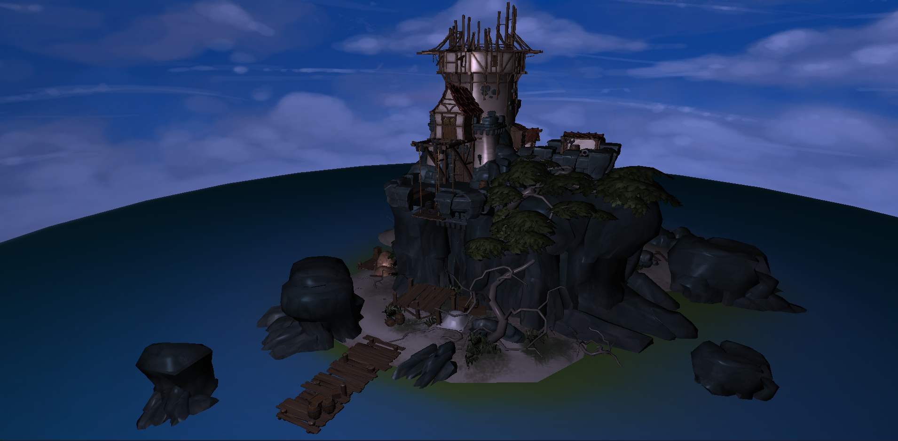
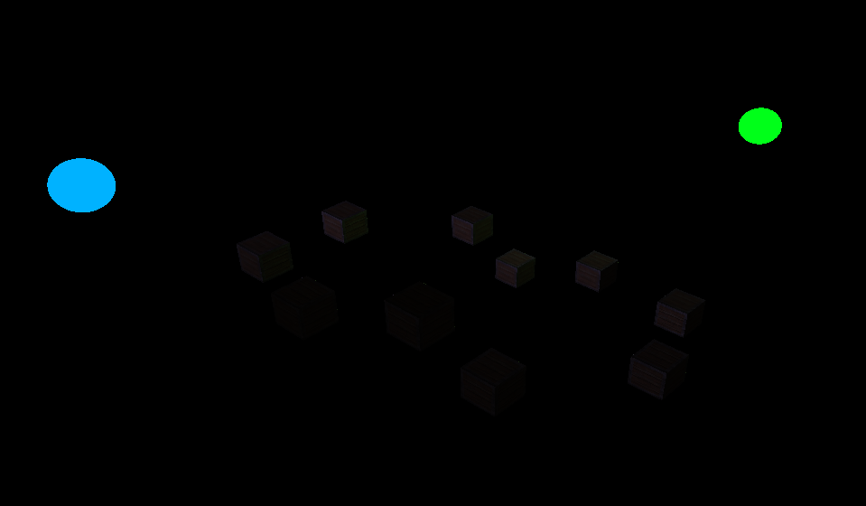

# OrionGL

C++ OpenGL application developed as part of a graphics and engine-learning portfolio. The project demonstrates a custom OpenGL rendering engine built using modern C++ practices, organized with clean architecture and an extensible design.

---

## Badges


---

## Overview

**OpenGL Learning** is a modular rendering project written in C++ and powered by pure OpenGL. It currently features a symbolic solar system demonstration but is architected to support any 3D model or scene through an extensible engine layer.

This project is intended both as a learning tool and as a portfolio piece showcasing engine structure, graphics programming, and software engineering best practices.

---

## Features

* GLFW window and input management
* GLAD for OpenGL function loading
* ASSIMP model loading
* Fully custom rendering pipeline
* Clean object-oriented design
* Separation of concerns and clean architecture
* Entity polymorphism for scene components
* Performance-aware design

---

## Roadmap

* Physics Engine
* Collision Detection
* Text Rendering
* UI System
* Additional rendering improvements

---

## Dependencies

* **GLFW 3** — window and input handling
* **GLAD** — OpenGL loader
* **GLM** — mathematics library
* **ASSIMP** - 3D model loader
* **GoogleTest** — testing framework

---
## Samples Ilustrations

### Sea Keep "Lonely Watcher"


### Multiple point lights


---

## Building from Source

To build the project using CMake:

```bash
mkdir build
cd build
cmake .. -DCOMPILE_SAMPLES=ON
cmake --build . --target assimp_sample_exec 
```

---

## License

This project is licensed under the **MIT License**.

You are free to use, modify, and distribute the software as long as the terms of the license are respected.

---

## Credits

### Assimp sample model
* title:	Sea Keep "Lonely Watcher"
* [source: sketchfab](https://sketchfab.com/3d-models/sea-keep-lonely-watcher-09a15a0c14cb4accaf060a92bc70413d)
* [author:	Artjoms Horosilovs](https://sketchfab.com/Artjoms_Horosilovs)

---

## References

* [LearnOpengl](https://learnopengl.com) Learning OpenGL tutorial.

---
